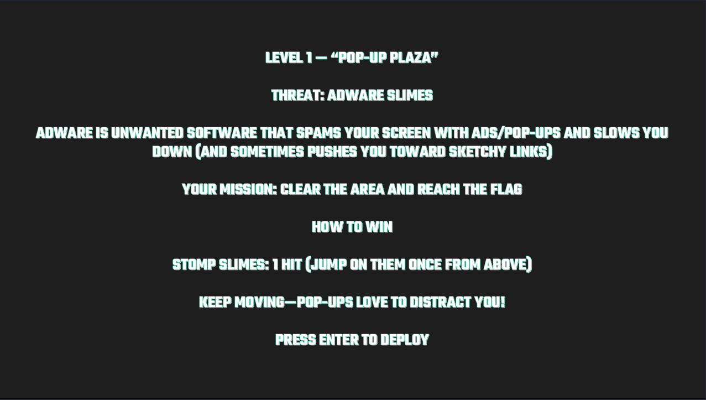
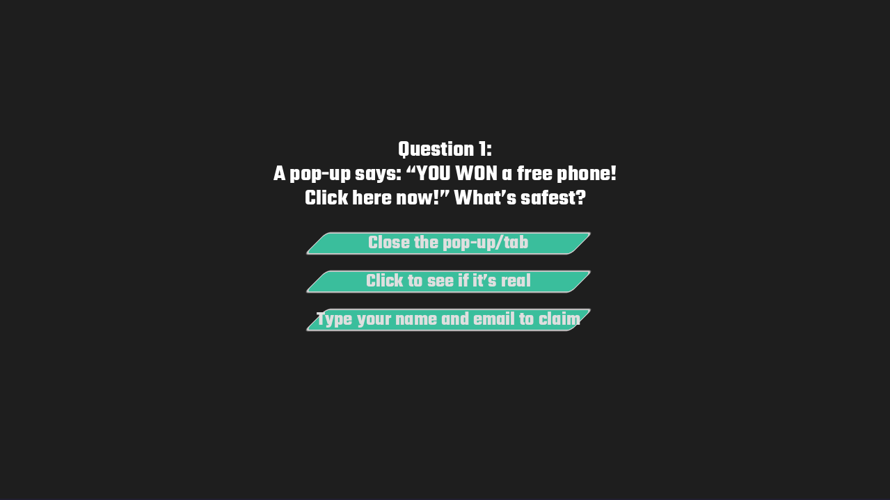
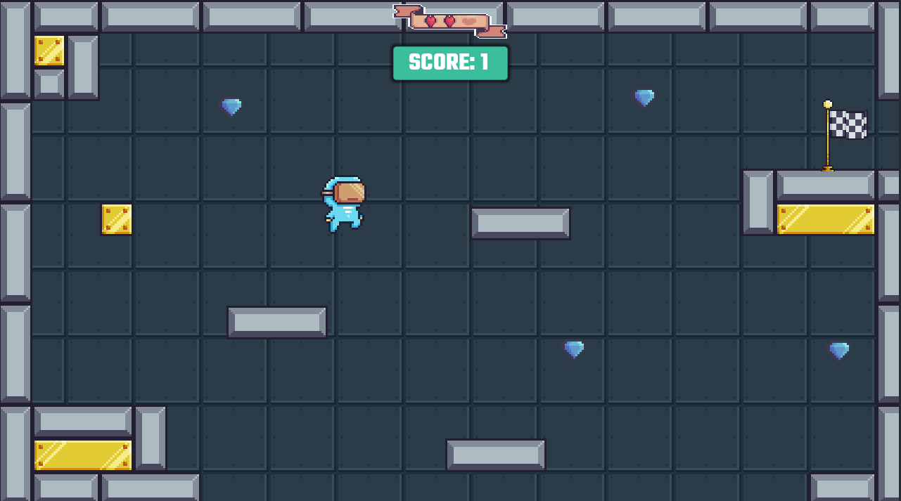
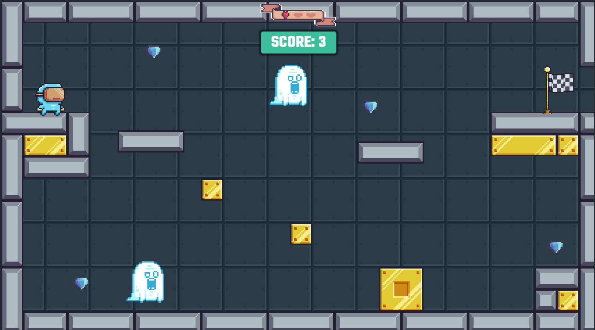

# NetSafe Heroes (Македонски) 🛡️

> Едукативна 2D игра направена во **Godot 4** која има имплементирано реални основи на сајбер-безбедност преку стилот на гејмплеј + кратки квиз прашања.
---
## Слики 

---

## Опис
NetSafe Heroes е едукативна игра со пиксел-арт во која херојот влегува во компјутерски систем и се бори против вируси и дигитални чудовишта за да го обнови и заштити системот. Како што играчот напредуваат низ нивоата, тој се среќава со различни сајбер закани како што се рекламен софтвер, фишинг стапици, шпионски софтвер, тројански коњи и рансомвер. Со завршувањето на секое ниво, играчот не само што го чисти системот, туку и учи основни концепти за безбедност на интернет. По секое ниво, играчот одговара на кратко прашање дизајнирано да го зајакне знаењето за сајбер безбедност, помагајќи му да препознае сомнителни врски, да разбере вообичаени онлајн закани и да изгради побезбедни навики за навигација на интернет.

### Главна едукативна механика (Квиз → Животи)
По завршување на секое ниво се појавува **Прашање**:
- ✅ Точен одговор: **+1 живот**
- ❌ Неточен одговор: **-1 живот**
- 💀 0 животи: **Играта заврши**

Ова прави учењето директно да влијае на прогресијата во играта.

---

## Нивоа и закани
1. **Pop-up Plaza** — Рекламен софтвер
2. **Phishing Pits** — Фишинг стапици  
3. **Spyware Shadows** — Шпионски софтвер  
4. **Trojan Trickroom** — Тројански коњ  
5. **Ransomware Throne** — Рансомвер  

---

## Како се игра
### Цел
Помини го нивото (избегнувај закани/пречки), стигни до крај, па одговори на прашањето за да ги задржиш/зголемиш животите.

### Контроли
- **Движење:** Arrow Keys (**↑ ↓ ← →**) или **W A S D**
- **Скок:** **Space** копчето
- **Инфо / Правила**: се прикажуваат на секое ниво посевно
- **Enter:** потврди/затвори панели за прашања (кога се прикажани)
- **Esc:** мени за пауза

---

## Инсталација и стартување (од изворен код)
1. Инсталирај **Godot 4.5.x** (или компатибилна Godot 4 верзија)
2. Отвори го проект фолдерот во Godot
3. Притисни **Play (F5)**

---

## Кратка техничка документација
- **Engine:** Godot 4 (GDScript)  
- **UI панели:** DescriptionPanel (инфо за ниво), Question Panel (квиз), Pause menu  
- **Flow:** Level → Finish trigger → Question Panel → +/- life → Next / Game Over

---

# NetSafe Heroes (English) 🛡️

> An educational 2D game made in **Godot 4** that implements real-world cybersecurity fundamentals through gameplay style + short quiz questions.
---
## Screenshots

---

## Description
NetSafe Heroes is a pixel-art educational game in which the hero enters a computer system and battles viruses and digital monsters to restore and protect the system. As the player progresses through the levels, he encounters different cyber threats such as adware, phishing, spyware, trojan horses, and ransomware. By completing each level, the player not only cleans the system but also learns essential internet safety concepts through interactive gameplay. After every level, the player answers a short question designed to reinforce cybersecurity knowledge, helping him recognize suspicious links, understand common online threats, and build safer habits for navigating the internet.

### Main Educational Mechanics (Quiz → Lives)
After completing each level, a **Question** appears:
- ✅ Correct answer: **+1 life**
- ❌ Incorrect answer: **-1 life**
- 💀 0 lives: **Game over**

This makes learning directly affect the progression in the game.

---

## Levels and Threats
1. **Pop-up Plaza** — Adware
2. **Phishing Pits** — Phishing Traps
3. **Spyware Shadows** — Spyware
4. **Trojan Trickroom** — Trojan Horse
5. **Ransomware Throne** — Ransomware

---

## How to Play
### Objective
Pass the level (avoid threats/obstacles), reach the end, then answer the question to keep/increase lives.

### Controls
- **Movement:** Arrow Keys (**↑ ↓ ← →**) or **W A S D**
- **Jump:** **Space** key
- **Info / Rules**: displayed on each level separately
- **Enter:** confirm/close question panels (when displayed)
- **Esc:** pause menu

---

## Installation and Startup (from source code)
1. Install **Godot 4.5.x** (or compatible Godot 4 version)
2. Open the project folder in Godot
3. Press **Play (F5)**

---

## Short Technical Documentation
- **Engine:** Godot 4 (GDScript)
- **UI Panels:** DescriptionPanel (level info), Question Panel (quiz), Pause menu
- **Flow:** Level → Finish trigger → Question Panel → +/- life → Next / Game Over

---
