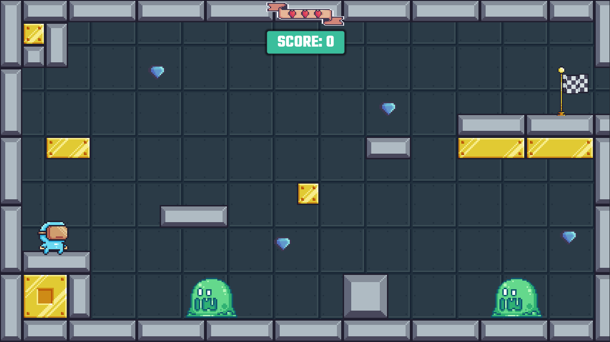

# NetSafe Heroes (English) 🛡️

> A Godot 4 pixel-art educational game that teaches real cybersecurity basics through gameplay and short quizzes.

---

## Quick Play

[Play NetSafe Heroes in Browser](https://andrejristovski.github.io/NetSafeHeroes/)

**Note:** The web build is optimized for **1280 × 720** resolution only.

---

## What Is NetSafe Heroes?

NetSafe Heroes is a pixel-art educational 2D game where the player enters a computer system and fights digital threats to restore and protect it.

As the player progresses through the levels, they encounter different cybersecurity threats such as adware, phishing traps, spyware, trojan horses, and ransomware. After each level, the player answers a short quiz question designed to reinforce cybersecurity knowledge and build safer online habits.

---

## Gameplay Loop

**Level → Reach Finish → Quiz → Lives Update → Next Level / Game Over**

### Core Mechanic: Quiz → Lives

- ✅ Correct answer: **+1 life**
- ❌ Incorrect answer: **-1 life**
- 💀 0 lives: **Game Over**

Your knowledge directly affects your survival and progression.

---

## Levels and Threats

| Level | Threat |
| --- | --- |
| **Pop-up Plaza** | Adware |
| **Phishing Pits** | Phishing Traps |
| **Spyware Shadows** | Spyware |
| **Trojan Trickroom** | Trojan Horse |
| **Ransomware Throne** | Ransomware |

---

## Controls

- **Move:** Arrow Keys (**↑ ↓ ← →**) or **W A S D**
- **Jump:** **Space**
- **Enter:** Confirm / close question panels (when shown)
- **Esc:** Pause menu
- **Info / Rules:** Displayed separately on each level

---

## Screenshots

---

## Run from Source

1. Install **Godot 4.5.x** (or any compatible Godot 4 version)
2. Open the project folder in Godot
3. Press **Play (F5)**

---

## Technical Notes

- **Engine:** Godot 4 (GDScript)
- **UI Panels:** `DescriptionPanel` (level info), `QuestionPanel` (quiz), `PauseMenu`
- **Flow:** Level → Finish Trigger → Question Panel → +/- Life → Next Level / Game Over

---

# NetSafe Heroes (Македонски) 🛡️

> Едукативна 2D пиксел-арт игра во Godot 4 што учи реални основи на сајбер-безбедност преку гејмплеј и кратки квиз прашања.

---

## Играј во прелистувач

[Играј ја NetSafe Heroes во веб-прелистувач](https://andrejristovski.github.io/NetSafeHeroes/)

**Забелешка:** Веб-верзијата е оптимизирана само за резолуција **1280 × 720**.

---

## Што е NetSafe Heroes?

NetSafe Heroes е едукативна 2D пиксел-арт игра во која играчот влегува во компјутерски систем и се бори против дигитални закани за да го обнови и заштити.

Како што играчот напредува низ нивоата, се среќава со различни сајбер закани како што се рекламни програми, фишинг стапици, шпионски софтвер, тројански коњи и рансомвер. По секое ниво, играчот одговара на кратко квиз прашање дизајнирано да го зајакне знаењето за сајбер-безбедност и да помогне во создавање побезбедни интернет навики.

---

## Тек на играта

**Ниво → Стигни до крај → Квиз → Ажурирање на животи → Следно ниво / Крај на игра**

### Главна механика: Квиз → Животи

- ✅ Точен одговор: **+1 живот**
- ❌ Неточен одговор: **-1 живот**
- 💀 0 животи: **Играта завршува**

Знаењето директно влијае на преживувањето и напредокот во играта.

---

## Нивоа и закани

| Ниво | Закана |
| --- | --- |
| **Pop-up Plaza** | Рекламен софтвер |
| **Phishing Pits** | Фишинг стапици |
| **Spyware Shadows** | Шпионски софтвер |
| **Trojan Trickroom** | Тројански коњ |
| **Ransomware Throne** | Рансомвер |

---

## Контроли

- **Движење:** Arrow Keys (**↑ ↓ ← →**) или **W A S D**
- **Скок:** **Space**
- **Enter:** Потврда / затворање на панелите со прашања (кога се прикажани)
- **Esc:** Мени за пауза
- **Инфо / Правила:** Се прикажуваат посебно на секое ниво

---

## Слики

---

## Стартување од изворен код

1. Инсталирај **Godot 4.5.x** (или компатибилна Godot 4 верзија)
2. Отвори го проектниот фолдер во Godot
3. Притисни **Play (F5)**

---

## Технички белешки

- **Engine:** Godot 4 (GDScript)
- **UI панели:** `DescriptionPanel` (инфо за ниво), `QuestionPanel` (квиз), `PauseMenu`
- **Flow:** Ниво → Finish Trigger → Question Panel → +/- Life → Следно ниво / Game Over

---
